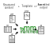

# markmeld

`markmeld` is a command-line tool for integrating structured data from `yaml` or `markdown` files into `markdown` output using `jinja2` templates. The name `markmeld` refers to it as a *markup* *melder*. It makes it easy to restructure your structured data into different output formats. It's a companion to pandoc that allows you to merge and shape various data, from yaml or markdown documents, and output them into markdown format that can then (optionally) be piped to pandoc.




## Install

```
pip install https://github.com/databio/markmeld/archive/refs/heads/master.zip
```

Markmeld provides the `mm` executable:

```
cd demo
mm default
```

This will produce the output, automatically piping to pandoc. You can also get the raw output with `-p`, like this:

```
mm default -p > rendered.md
```

## Markmeld config file

You produce a file called `_markmeld.yaml` to configure your project. In the file you specify any variables you want,  The `demo/_markmeld.yaml` looks like this:

```
targets:
  default:
    md_template: md_template.jinja
latex_template: pandoc_default.tex
output_file: "{today}_demo_output.pdf"
data_yaml:
  - some_data.yaml
data_md:
  some_text_data: some_text.md
```

The configurable attributes are:

- `targets`: a list of targets (outputs) to build. Each target can contain the other configurable attributes.
- `data_yaml` - a list of yaml files to make available to the templates
- `data_md` - a named list of markdown files, which will be made available to the templates
- `data_variables` - direct yaml data made available to the templates.
- `data_md_globs` - Globs, where each file will be read, and available at the key of the filename.
Any other attributes will be made available to the build system, but not to the jinja templates.

In the demo, the only target you can build is `default`. You can see the list of targets with `mm -l`. 

## md jinja template

Your markdown items will be available under the key you specify in the config. If you are using the `_globs` key, then they will be available under the filename. You can then access them in the jinja template as variables, like this:

```
{{ variable.content }}
```

The `.content` attribute will have the actual markdown -- this is probably what you want. But if you want metadata, you can also access that under `{{ variable.metadata }}`.


## The jinja md array

See detailed instructions for how to access md content with variable names using the md array.

## Hooks

You can add a 'prebuild' hook, which runs a separate target them by adding:

```
prebuild: 
  - manuscript_supplement
  - manuscript
postbuild:
  - split
```

in `_markmeld.yaml`. This allows you to build another recipe before the current one. These recipes can be built-in recipes (which are in `mm_targets`), or can be recipes from your cfg file. I'm using built-in recipes to provide alternative commands, like building figures or splitting stuff. I guess I could make these command templates instead.

## Imports

It's super useful to define global config options, and then re-use them across projects. You can do this with `imports`.So I have a global config file, say `/_markmeld_config.yaml`:

```yaml
sciquill: /home/nsheff/code/sciquill/
figczar: /home/nsheff/code/sciquill/pandoc_filters/figczar/figczar.lua
highlighter: /home/nsheff/code/sciquill/pandoc_filters/change_marker/change_marker.lua
multirefs: /home/nsheff/code/sciquill/pandoc_filters/multi-refs/multi-refs.lua
csl: /home/nsheff/code/sciquill/csl/biomed-central.csl
bibdb: /home/nsheff/code/papers/sheffield.bib
```

Now you use:
```yaml
imports:
- /_markmeld_config.yaml
```

And now I can use `{figczar}` and `{bibdb}` in `command` section of a `_markmeld.yaml` file. If you want to be really cool, maybe point to this config file with `$MARKMELD` and then use:

```yaml
imports:
- $MARKMELD
```

It works! Imports are in priority order, and lower priority than whatever you have in the local file, like `css`.  You can also define targets and import them.

## Raw commands

If in a command you use `type: raw`, then the command will run directly, and not pass the template render as stdin.

## Commands without pandoc

Usually, I want to run whatever my template is through pandoc, to produce the output. Markmeld first creates markdown using the jinja template, and then passes this to pandoc to convert to the final output.

But sometimes, the output I make from the jinja template is *not* markdown, and that's my end product. For example, I may want to produce a `csv` file representation of some data I had in yaml format. Markmeld can also do this. In this case, you would just change the `command`, and don't use pandoc.

```
command: |
  cat > {output_file}
```

Then, your jinja template would spit out a csv file. This command basically just writes that to an output file. You can use it to get the output from jinja directly.

## Rationale

Why is this better than just stringing stuff together using pandoc? Well, for one, the power of a jinja template is pretty nice... so I can just tell markmeld about all the data, which can be either markdown or yaml, and then using jinja I can restructure the output in whatever format I want. Furthermore, it allows me to intersperse yaml data in there. Without markmeld, I couldn't really find an easy way to integrate prose content (in markdown format) with structured content (in yaml format) into one output. This is useful for something like a CV/Biosketch, where I have some prose components, and then some lists, which I'd rather draw from a structured YAML file.

For simple documents like a manuscript that don't really use much structured content and are purely gluing together prose, you can get by with just straight-up pandoc. You'd just pass multiple markdown files directly to pandoc on the command line. But even in these situations, you gain something from going the route of the jinja template with markmeld: it formalizes the linking of documents into a separate file, instead of relying the on order and content of CLI arguments to pandoc. So you can more easily write a little recipe saying, "provide these pieces of content under these names, and then use this jinja template to produce the output". So, it makes that recipe reproducible.

## How to write mail-merge letters with markmeld

1. Data

You need a `data.yaml` file like this. This is a list of people you want to send the letter to:

```
people:
  - first_name: Bob
    last_name: Jones
    email: bob.jones@gmail.com
```

2. Letter

Write your letter in a jinja template like this `letter.jinja`:

```


<a href="mailto:{{ person.email }}?subject=SUBJECT&body=Hi {{person.first_name}},%0D%0A%0D%Letter contentt %0D%0A%0D%0AThanks, and we should catch up some time!%0D%0A%0D%0A-Nathan">{{ person.first_name }}</a>


```

3. Markmeld config in `_markmeld.yaml`:

Which is something like:

```
imports:
  - $MMDIR/$HOSTNAME.yaml
targets:
  links:
    md_template: letter_template.jinja
    output_file: "{today}.html"
    data_yaml:
      - data.yaml
    command: |
      pandoc \
        -o {output_file}
```

Now just `mm links`, open the file, and you have personalized click links for all your letters. Easy peasy!


## Testing

You can test with:

```
pytest
```

I'm still working on that. You can also just build the demos.

```
cd demo
mm default
```


