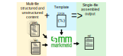

# 

## Introduction

Markmeld is a a *markdown* *melder*. It is a command-line tool for merging `yaml` and `markdown` content using `jinja2` templates. The ability to integrate unstructured content in `md` format with structured content, like lists or objects, in `yaml` format makes it possible to produce essentially any type of output document, such as a resume, biosketch, publication, proposal, book, or more.

Markmeld is useful independently, but is particularly powerful when combined with `pandoc` -- the merged markmeld output in markdown format may be piped to pandoc, making it easy to format the output in a variety of downstream output types, such as HTML or PDF via LaTeX. This lets you design design powerful multi-file documents, restructured into different output formats.

## Rationale

Why is this better than just stringing stuff together using pandoc? Well, for one, the power of a jinja template is pretty nice... so I can just tell markmeld about all the data, which can be either markdown or yaml, and then using jinja I can restructure the output in whatever format I want. Furthermore, it allows me to intersperse yaml data in there. Without markmeld, I couldn't really find an easy way to integrate prose content (in markdown format) with structured content (in yaml format) into one output. This is useful for something like a CV/Biosketch, where I have some prose components, and then some lists, which I'd rather draw from a structured YAML file.

For simple documents like a manuscript that don't really use much structured content and are purely gluing together prose, you can get by with just straight-up pandoc. You'd just pass multiple markdown files directly to pandoc on the command line. But even in these situations, you gain something from going the route of the jinja template with markmeld: it formalizes the linking of documents into a separate file, instead of relying the on order and content of CLI arguments to pandoc. So you can more easily write a little recipe saying, "provide these pieces of content under these names, and then use this jinja template to produce the output". So, it makes that recipe reproducible.
